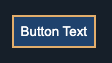

### **Énoncé de l'exercice technique : Créer une application React avec TypeScript, Vite et JSONPlaceholder**

#### **Contexte :**

Vous devez créer une application React en TypeScript en utilisant Vite comme outil de build. L'application interagira avec l'API JSONPlaceholder pour gérer des publications (posts) et leurs commentaires. **Vous n'avez pas besoin de vous préoccuper du CSS pour cet exercice.** Concentrez-vous uniquement sur la logique et la structure de l'application.

---

### **Étapes à réaliser :**

#### **Étape 1 : Afficher la liste des publications**

- Utilisez l'API `https://jsonplaceholder.typicode.com/posts` pour récupérer la liste des publications.
- Affichez les publications dans une liste ordonnée. Chaque publication doit afficher son **titre** et un bouton "Voir les commentaires".

  **Exemple d'affichage des publications :**

  ```
  Liste des publications :
  -----------------
  1. Titre de la publication 1 [Voir les commentaires]
  2. Titre de la publication 2 [Voir les commentaires]
  3. Titre de la publication 3 [Voir les commentaires]
  ```

---

#### **Étape 2 : Afficher et masquer les commentaires d'une publication**

- Lorsque l'utilisateur clique sur le bouton "Voir les commentaires" d'une publication, utilisez l'API `https://jsonplaceholder.typicode.com/posts/{postId}/comments` pour récupérer les commentaires associés à cette publication.

- Affichez les commentaires sous la publication sélectionnée. Chaque commentaire doit afficher son **nom** (name) et son **contenu** (body).
- Ajoutez un bouton "Cacher les commentaires" pour masquer les commentaires lorsqu'ils sont affichés.
- Une fois les commentaires d'une publication sont récupérés et affichés, on ne refait pas la requête si on les cache et on les réaffichent.
- Le bouton "Voir les commentaires" doit devenir "Cacher les commentaires" lorsque les commentaires sont visibles, et inversement.

Exemple de déroulement :
  - J'arrive sur la page => Je récupère toutes les publications et je les affichent (Étape 1).
  - Je clique sur le bouton "Voir les commentaires" de la deuxième publication => Je récupère les commentaires de cette dernière et je les affiche.
  - Je clique sur le bouton "Voir les commentaires" de la quatrième publication => Je récupère les commentaires de cette dernière et je les affiche. Les commentaires de la **deuxième** publication restent affichés.
  - Je clique sur le bouton "Cacher les commentaires" de la deuxième publication => Je cache les commentaires de cette dernière. Les commentaires de la **quatrième** publication restent affichés.
  - Je clique sur le bouton "Voir les commentaires" de la deuxième publication => Je réaffiche les commentaires affichés initialement, sans refaire la requête.


  **Exemple d'affichage des commentaires :**

  ```
  Liste des publication :
  -----------------
  1. Titre de la publication 1 [Cacher les commentaires]
     Commentaires :
     - Nom : Commentateur 1
       Contenu : Ceci est un commentaire intéressant.
     - Nom : Commentateur 2
       Contenu : Un autre commentaire pertinent.
  2. Titre de la publication 2 [Voir les commentaires]
  3. Titre de la publication 3 [Cacher les commentaires]
     Commentaires :
     - Nom : Commentateur 1
       Contenu : Ceci est un commentaire intéressant.
     - Nom : Commentateur 2
       Contenu : Un autre commentaire pertinent.
  ```

---

#### **Étape 3 : Ajouter une nouvelle publication**

- Ajoutez un formulaire permettant à l'utilisateur de créer une nouvelle publication. Le formulaire doit contenir deux champs : **titre** et **contenu**.
- Le formulaire doit être affiché **avant la liste des publications**.
- Lorsque l'utilisateur soumet le formulaire, utilisez l'API `https://jsonplaceholder.typicode.com/posts`
  avec la méthode `POST` pour ajouter la nouvelle publication.

Données à POSTer:

```json
{
  "title": "foo",
  "body": "bar",
  "userId": 1
}
```

En-tête HTTP:

```
Content-type: application/json; charset=UTF-8
```

- Après l'ajout, mettez à jour la liste des publication pour afficher le nouveau post (notez que le post ne sera pas réellement ajouté sur le serveur, mais simulez l'ajout côté client).

  **Exemple d'affichage du formulaire et de la liste des posts :**

  ```
  Ajouter un nouveau post :
  -------------------------
  Titre : [__________]
  Contenu : [__________]
  [Ajouter]

  Liste des posts :
  -----------------
  1. Titre du post 1 [Voir les commentaires]
  2. Titre du post 2 [Voir les commentaires]
  3. Titre du post 3 [Voir les commentaires]
  4. Nouveau titre [Voir les commentaires]  <-- Nouveau post ajouté
  ```

---

### **Contraintes techniques :**

- Utilisez **TypeScript** pour typer les données (publications, commentaires, etc.).
- Utilisez **Vite** comme outil de build.
- Structurez votre code en composants réutilisables.

---

### **Bonus (si vous avez le temps) :**

1. Centrer l'affichage des publications horizontalement dans la page. La largeur du container doit être de 500px.
2. Afficher les body des publications. Afficher qu'une seule ligne. Le contenu peut être tronqué.
3. Utilisez styled-component pour créer un composant Bouton générique, qu'on peut lui passer un label, une couleur de label, une couleur d'arrrière plan, une bordure et un espacement interne (entre la bordure et le texte)

   

Utiliser des styles différents pour les boutons "Voir les commentaires" et "Cacher les commentaires"

4. Ajoutez une gestion des erreurs pour les requêtes API.
5. Ajoutez un indicateur de chargement pendant les requêtes.

---

### **Livrables attendus :**

1. Une interface utilisateur qui affiche le formulaire d'ajout de publication, la liste des publications, et les commentaires.
2. Un code propre, bien structuré.

---

**Objectif :** Montrer vos compétences en React, TypeScript, gestion d'API avec `fetch`, et structure de composants.

Bonne chance ! 🚀
